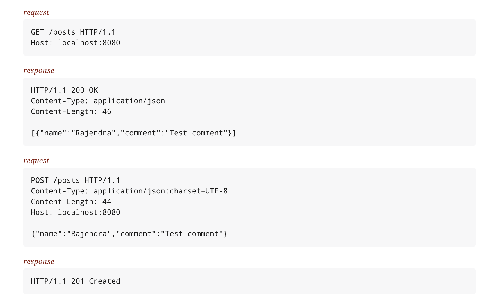

# Guestbook

###request
GET `/posts` 

###response
HTTP/1.1 200 OK
Content-Type: application/json

>[{"name":"Rajendra","comment":"Test comment"}]
###request
POST `/posts `

>{"name":"Rajendra","comment":"Test comment"}
###response
>HTTP/1.1 201 Created

[API Spec](./build/asciidoc/html5/index.html)
